<!--
  The SVGs in ./assets are generated: edit scripts/content.mjs, then run `npm install && npm run build`.
  The activity card is rebuilt daily by .github/workflows/activity.yml and published to the `output` branch.
  Palette (Tokyo Night): blue #70a5fd = web · purple #bf91f3 = mobile · teal #38bdae = IoT
-->

  <picture>
    <source media="(prefers-color-scheme: dark)" srcset="./assets/hero-dark.svg">
    <source media="(prefers-color-scheme: light)" srcset="./assets/hero-light.svg">
    
  </picture>

  <a href="https://linkedin.com/in/bintangfabian"><picture><source media="(prefers-color-scheme: dark)" srcset="./assets/btn-linkedin-dark.svg"><source media="(prefers-color-scheme: light)" srcset="./assets/btn-linkedin-light.svg"></picture></a>
  <a href="mailto:bintangalfin33@gmail.com"><picture><source media="(prefers-color-scheme: dark)" srcset="./assets/btn-email-dark.svg"><source media="(prefers-color-scheme: light)" srcset="./assets/btn-email-light.svg"></picture></a>
  <a href="https://instagram.com/bintangfabiaan"><picture><source media="(prefers-color-scheme: dark)" srcset="./assets/btn-instagram-dark.svg"><source media="(prefers-color-scheme: light)" srcset="./assets/btn-instagram-light.svg"></picture></a>

  <picture>
    <source media="(prefers-color-scheme: dark)" srcset="./assets/section-about-dark.svg">
    <source media="(prefers-color-scheme: light)" srcset="./assets/section-about-light.svg">
    
  </picture>

I'm a software engineer from Bekasi, Indonesia, driven by curiosity and a constant desire to learn new things about technology. I work across **front-end web**, **mobile apps** and **IoT systems**, and I love turning complex ideas into simple, functional solutions. Got a project in mind? I'm always up for a collaboration.

  <picture>
    <source media="(prefers-color-scheme: dark)" srcset="./assets/focus-dark.svg">
    <source media="(prefers-color-scheme: light)" srcset="./assets/focus-light.svg">
    
  </picture>

  <picture>
    <source media="(prefers-color-scheme: dark)" srcset="./assets/section-work-dark.svg">
    <source media="(prefers-color-scheme: light)" srcset="./assets/section-work-light.svg">
    
  </picture>

  <a href="https://github.com/bintangfabian/Bhumi"><picture><source media="(prefers-color-scheme: dark)" srcset="./assets/project-bhumi-dark.svg"><source media="(prefers-color-scheme: light)" srcset="./assets/project-bhumi-light.svg"></picture></a>
  <a href="https://github.com/bintangfabian/Talenta-Lestari"><picture><source media="(prefers-color-scheme: dark)" srcset="./assets/project-talenta-dark.svg"><source media="(prefers-color-scheme: light)" srcset="./assets/project-talenta-light.svg"></picture></a>
  <a href="https://github.com/bintangfabian/byplant-frontend"><picture><source media="(prefers-color-scheme: dark)" srcset="./assets/project-byplant-dark.svg"><source media="(prefers-color-scheme: light)" srcset="./assets/project-byplant-light.svg"></picture></a>
  <a href="https://github.com/bintangfabian/Money-Mate"><picture><source media="(prefers-color-scheme: dark)" srcset="./assets/project-moneymate-dark.svg"><source media="(prefers-color-scheme: light)" srcset="./assets/project-moneymate-light.svg"></picture></a>

  <picture>
    <source media="(prefers-color-scheme: dark)" srcset="./assets/section-stack-dark.svg">
    <source media="(prefers-color-scheme: light)" srcset="./assets/section-stack-light.svg">
    
  </picture>

  <picture>
    <source media="(prefers-color-scheme: dark)" srcset="./assets/stack-dark.svg">
    <source media="(prefers-color-scheme: light)" srcset="./assets/stack-light.svg">
    
  </picture>

  <picture>
    <source media="(prefers-color-scheme: dark)" srcset="./assets/section-activity-dark.svg">
    <source media="(prefers-color-scheme: light)" srcset="./assets/section-activity-light.svg">
    
  </picture>

  <picture>
    <source media="(prefers-color-scheme: dark)" srcset="https://raw.githubusercontent.com/bintangfabian/bintangfabian/output/activity-dark.svg">
    <source media="(prefers-color-scheme: light)" srcset="https://raw.githubusercontent.com/bintangfabian/bintangfabian/output/activity-light.svg">
    
  </picture>

  <picture>
    <source media="(prefers-color-scheme: dark)" srcset="./assets/footer-dark.svg">
    <source media="(prefers-color-scheme: light)" srcset="./assets/footer-light.svg">
    
  </picture>

